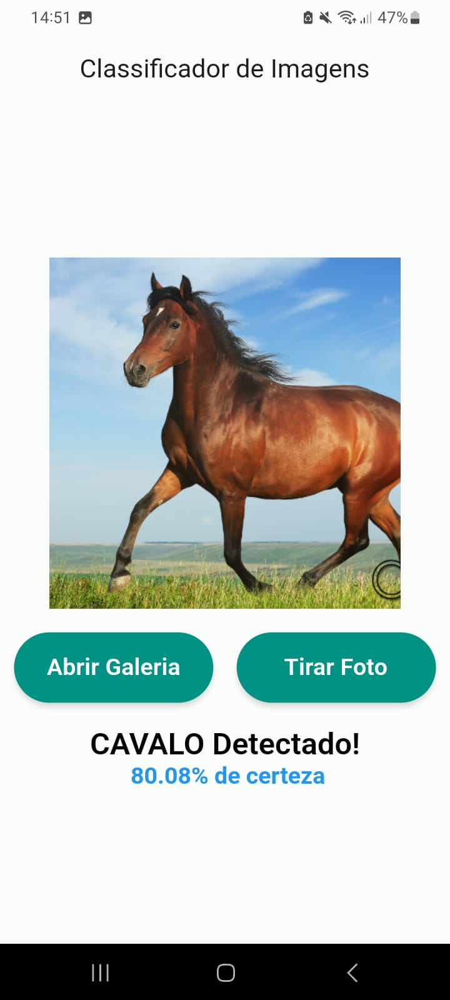

# TensorFlow Lite v2.0.0 - Exemplo de classificação de imagens

Este projeto é um exemplo de como utilizar o TensorFlow Lite para executar modelos de Deep Learning em dispositivos móveis. O modelo utilizado foi treinado com milhares de imagens aleatórias de gatos e cachorros entre outros que você pode encontrar na pasta assets/labels.txt. 

Não utilizo conceitos avançados de Deep Learning, apenas o básico para que você possa entender o funcionamento do TensorFlow Lite. Também não fiz nada avançado no flutter, se você tiver alguma sugestão de melhoria, fique a vontade para contribuir.

## Como funciona?
Você tem a opção de escolher uma imagem da galeria ou tirar uma foto. Após escolher a imagem, o modelo irá classificar a imagem e informar a probabilidade. Alguns casos o modelo pode errar, mas isso é normal, pois o modelo não é perfeito. Podemos melhorar o modelo com mais imagens e mais épocas de treinamento. Oberve alguns exemplos abaixo e também a acurácia do modelo por classe.:

